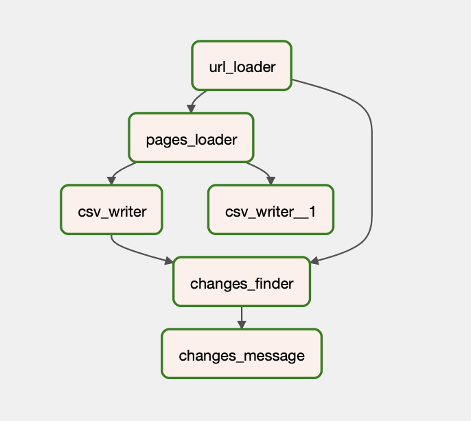

Парсер цен

Этот проект был создан из-за необходимости автоматизации рутинных процессов мониторинга цен на наиболее часто используемые 
в производстве товары строительного предназначения. Парсер написан на `Python` и в качестве средства загрузки страниц использует 
библиотеку `requests`. Работа парсера происходит в следующей последовательности:

1) Загрузка актуальных адресов страниц товаров из тектового файла
2) Загрузка страниц и поиск значений цены и названия товара по заданой фразе (кусок кода страницы).  
   Формирование словаря с данными о ценах/названиях (+ дата/время, доменное имя) и словаря с ошибками - ошибки доступа и парсинга;  
   Словарь с ошибками используется для отправки отдельного Tg-алерта;  
   Временной интервал между запросами к страницам можно выбирать, при этом предусмотрена рандомная составляющая этого интервала, т.е. он всегда 
   разный.
3) Запись в csv-файлы значений о ценах и ошибках
4) Поиск изменений в ценах/названих товаров. Поиск осуществляется с использованием актуального перечня адресов страниц товаров.  
   Формируется словарь с изменениями.
5) Формирование сообшения об изменениях
6) Отправка Tg-алерта об изменениях:
 

