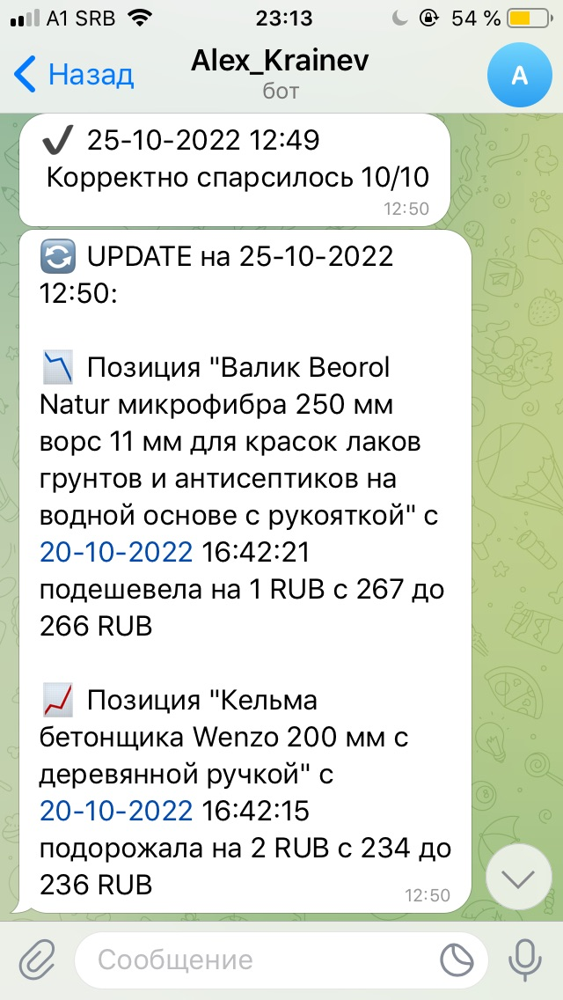

Парсер цен

Этот проект был создан из-за необходимости автоматизации рутинных процессов мониторинга цен на наиболее часто используемые 
в производстве товары строительного предназначения. Парсер написан на `Python` и в качестве средства загрузки страниц использует 
библиотеку `requests`. Работа парсера происходит в следующей последовательности:

1) Загрузка актуальных адресов страниц товаров из тектового файла
2) Загрузка страниц и поиск нужного значения цены по заданой фразе (кусок кода страницы)

